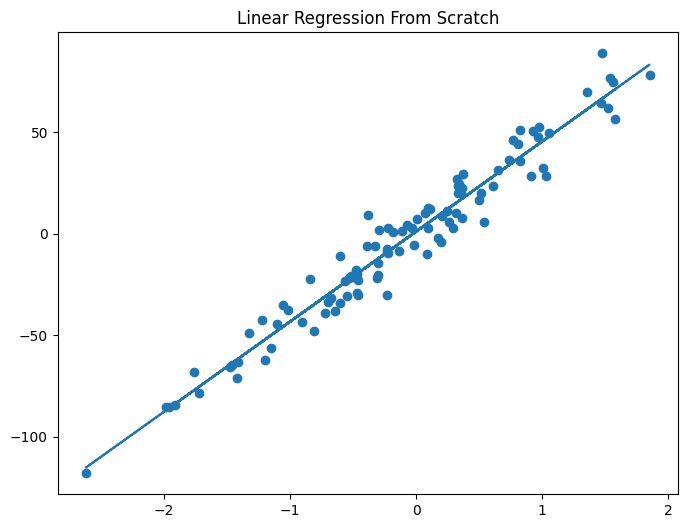
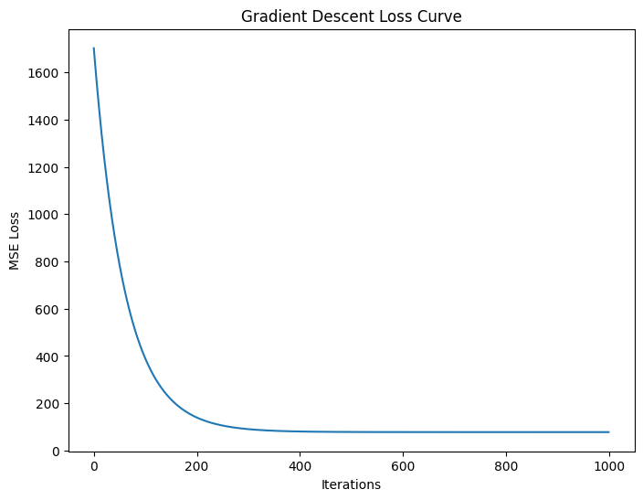
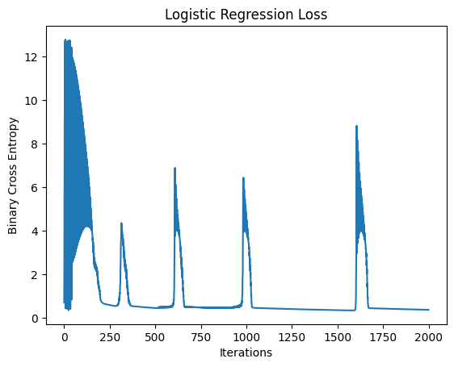
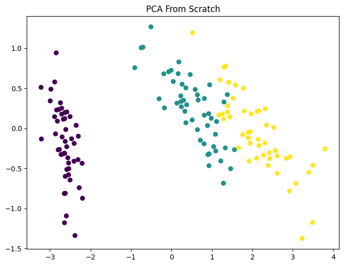
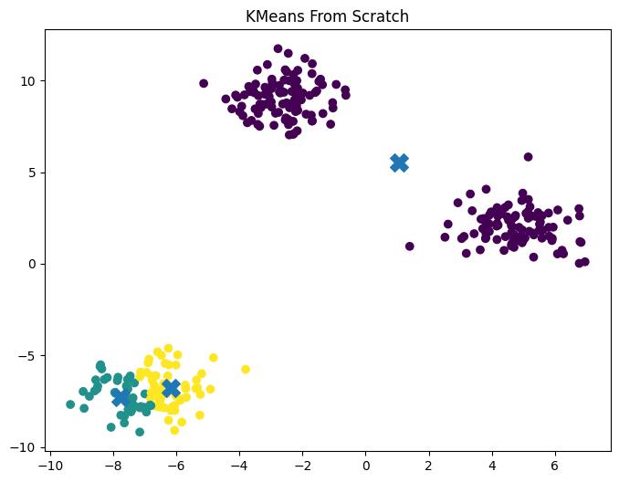
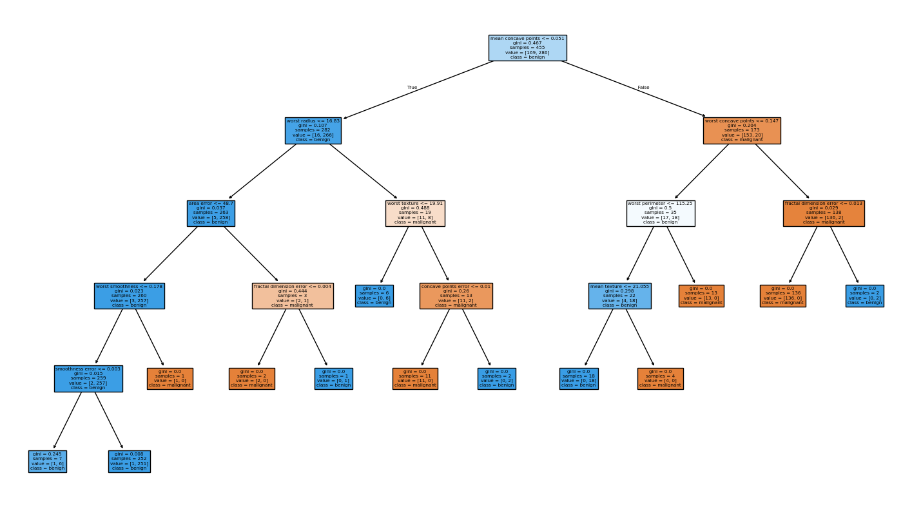
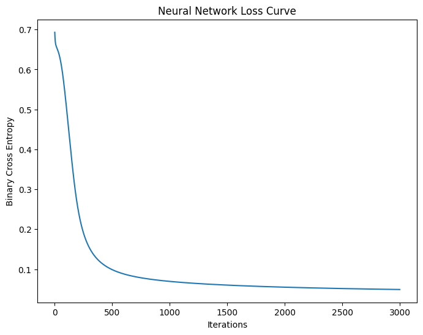

# Machine Learning From Scratch

A collection of Machine Learning algorithms implemented from first principles using **Python** and **NumPy**, with **Scikit-Learn** used only for benchmarking and validation.

The goal of this project is to understand the mathematical foundations behind machine learning algorithms rather than relying solely on high-level libraries.

---

## Algorithms Implemented

### Supervised Learning

- Linear Regression
- Logistic Regression
- Decision Tree
- Random Forest
- Feedforward Neural Network

### Unsupervised Learning

- Principal Component Analysis (PCA)
- K-Means Clustering

---

## Results

| Algorithm | My Implementation | Scikit-Learn |
|------------|------------|------------|
| Linear Regression | MSE: 78.05446 | MSE: 78.05425 |
| Logistic Regression | Accuracy: 94.74% | Accuracy: 95.61% |
| Decision Tree | Accuracy: 92.98% | Accuracy: 94.74% |
| Random Forest | Accuracy: 95.61% | Accuracy: 96.49% |
| PCA | Shape: (150, 2) | Shape: (150, 2) |
| K-Means | 3 Clusters Found | Benchmark Visualization |
| Neural Network | NumPy Implementation | MLPClassifier Benchmark |

---

## Visualizations

### Linear Regression Fit



### Gradient Descent Loss Curve



### Logistic Regression Loss Curve



### PCA From Scratch



### K-Means Clustering



### Decision Tree Visualization



### Neural Network Loss Curve



---

## Concepts Covered

### Optimization

- Gradient Descent
- Learning Rate Tuning
- Loss Minimization

### Regression

- Linear Regression
- Mean Squared Error (MSE)

### Classification

- Logistic Regression
- Sigmoid Function
- Binary Cross Entropy

### Tree-Based Learning

- Entropy
- Information Gain
- Recursive Splitting
- Bootstrap Aggregation (Bagging)

### Unsupervised Learning

- Principal Component Analysis
- Covariance Matrix
- Eigenvalues
- Eigenvectors
- K-Means Clustering
- Euclidean Distance

### Deep Learning

- Forward Propagation
- Backpropagation
- Hidden Layers
- Weight Updates
- Neural Network Training

---

## Project Structure

```text
ML-From-Scratch/
│
├── images/
│   ├── linear_regression_fit.png
│   ├── loss_curve.png
│   ├── logistic_loss_curve.png
│   ├── pca_from_scratch.png
│   ├── pca_sklearn.png
│   ├── kmeans_clusters.png
│   ├── decision_tree_visualization.png
│   └── neural_network_loss.png
│
├── models/
│   ├── linear_regression.py
│   ├── logistic_regression.py
│   ├── pca.py
│   ├── kmeans.py
│   ├── decision_tree.py
│   ├── random_forest.py
│   └── neural_network.py
│
├── notebooks/
│   ├── linear_demo.py
│   ├── logistic_demo.py
│   ├── pca_demo.py
│   ├── kmeans_demo.py
│   ├── decision_tree_demo.py
│   ├── random_forest_demo.py
│   └── neural_network_demo.py
│
├── run_all.py
├── requirements.txt
├── .gitignore
└── README.md
```

---

## Installation

Clone the repository:

```bash
git clone https://github.com/your-username/ML-From-Scratch.git
cd ML-From-Scratch
```

Install dependencies:

```bash
pip install -r requirements.txt
```

---

## Running Individual Algorithms

```bash
python notebooks/linear_demo.py
python notebooks/logistic_demo.py
python notebooks/pca_demo.py
python notebooks/kmeans_demo.py
python notebooks/decision_tree_demo.py
python notebooks/random_forest_demo.py
python notebooks/neural_network_demo.py
```

---

## Run Everything

```bash
python run_all.py
```

---

## Why This Project?

Most machine learning projects rely heavily on high-level frameworks. This repository focuses on implementing algorithms from scratch to build a deeper understanding of:

- Optimization
- Classification
- Regression
- Clustering
- Dimensionality Reduction
- Ensemble Learning
- Neural Networks

The implementations are benchmarked against Scikit-Learn to validate correctness and performance.

---

## Future Improvements

- Feature Importance for Random Forest
- Random Feature Selection in Forest Splits
- Support Vector Machine (SVM)
- Naive Bayes
- Convolutional Neural Networks
- Recurrent Neural Networks
- Model Evaluation Utilities
- Unit Tests

---

## Author

**Shagun Vishnoi**

B.Tech, Newton School of Technology

Passionate about Machine Learning, Deep Learning, and AI Systems.
